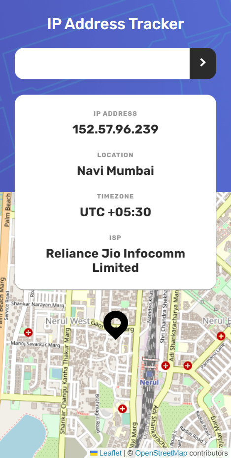
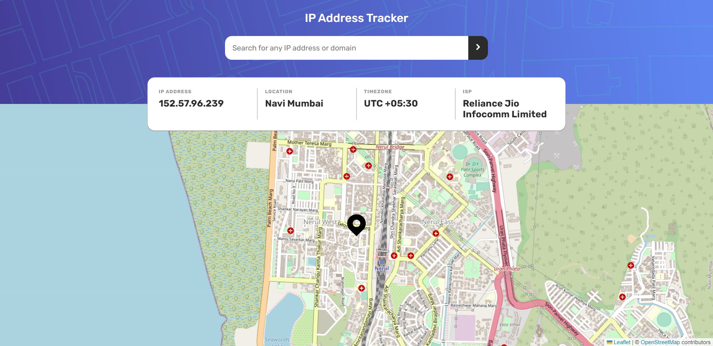

# Frontend Mentor - Calculator App Solution

This is a solution to the [IP address tracker challenge on Frontend Mentor](https://www.frontendmentor.io/challenges/ip-address-tracker-I8-0yYAH0). Frontend Mentor challenges help you improve your coding skills by building realistic projects.

## Table of contents

- [Overview](#overview)
  - [The challenge](#the-challenge)
  - [Screenshot](#screenshot)
  - [Links](#links)
- [My process](#my-process)
  - [Built with](#built-with)
  - [What I learned](#what-i-learned)
  - [Continued development](#continued-development)
  - [Useful resources](#useful-resources)
- [Author](#author)

## Overview

### The challenge

Users should be able to:

- View the optimal layout for each page depending on their device's screen size
- See hover states for all interactive elements on the page
- See their own IP address on the map on the initial page load
- Search for any IP addresses or domains and see the key information and location

### Screenshot

### Links

- Solution URL: [Github](https://github.com/atharvpote/IP-Address-Tracker)
- Live Site URL: [IP Address Tracker](https://fm-ip-tracker.netlify.app/)

## My process

### Built with

- Semantic HTML5 markup
- CSS custom properties
- Flexbox
- Mobile-first workflow
- [React](https://reactjs.org/) - JS library
- [Styled Components](https://styled-components.com/) - CSS in JS library
- [Leaflet](https://leafletjs.com/) - Open source maps library
- [React Leaflet](https://react-leaflet.js.org/) - React components for leaflet maps
- [Polished](https://styled-components.com/) - Toolset for writing styles in JS

### What I learned

This was a super fun project. I learned a lot about how to fetch API and how to fetch data. It was my first time using any map library, it was a bit confusing at first but I figured it our, overall it was a nice learning experience

### Continued development

I'm looking forward to use some other IP Geo Location API so app is not limited to 500 requests per month.

### Useful resources

- [React Docs](https://reactjs.org/docs/getting-started.html)
- [Styled Components Docs](https://styled-components.com/docs)
- [Leaflet Docs](https://leafletjs.com/reference.html)
- [React Leaflet Docs](https://react-leaflet.js.org/docs/)
- [React Leaflet Tutorial](https://blog.logrocket.com/react-leaflet-tutorial/)
- [Leaflet Map Centering On State Change](https://javascript.tutorialink.com/react-leaflet-map-center-not-changing/)
- [Polished Docs](https://polished.js.org/docs/)
- [MDN](https://developer.mozilla.org/en-US/)
- [Parcel Docs](https://parceljs.org/docs/)
- [ESLint Docs](https://eslint.org/docs/latest/)
- [Stylelint Docs](https://stylelint.io/)

## Author

- GitHub - [Atharv Pote](https://github.com/atharvpote)
- Frontend Mentor - [@atharvpote](https://www.frontendmentor.io/profile/atharvpote)
